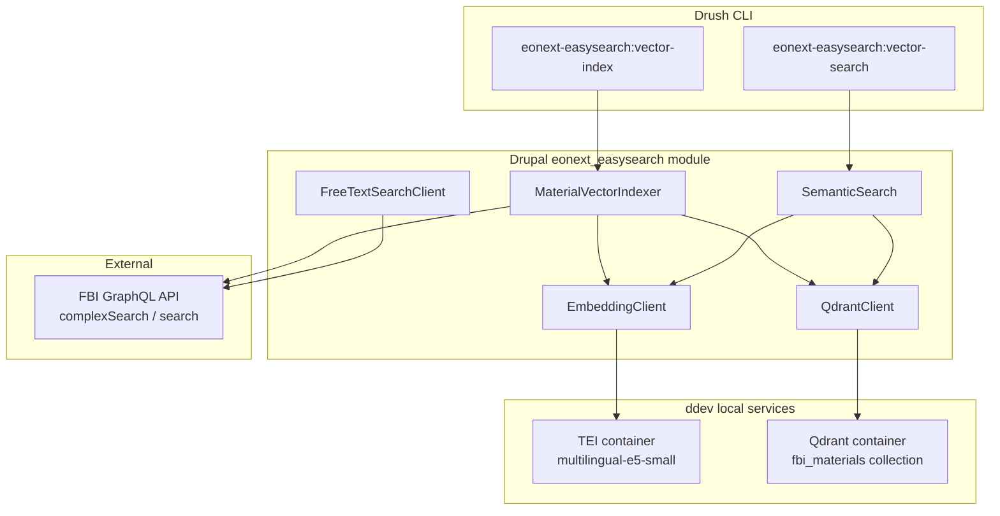

# FBI material vector search

Local semantic search over FBI catalog works. Natural-language queries (including
English against Danish metadata) are matched by **meaning**, not just keywords.

This is implemented in the `eonext_easysearch` module. It complements FBI's own
lexical search (`FreeTextSearchClient` / `dpl-fbi:search` in `dpl_fbi`), which is keyword-based.

**Documentation**

| Audience | Document |
|---|---|
| Stakeholders / admins | Drupal help page: `/admin/help/eonext_easysearch` (interactive tabs) |
| Technical / ops | Same help page — **Infrastructure** and **Connection map** tabs |
| Developers | This file |

## Architecture



## Services at each level

### 1. FBI GraphQL API (source of truth)

**Role:** Catalog data — what works exist and their metadata.

**Used by:**
- `MaterialVectorIndexer` — fetches works to index via `complexSearch`
- `FreeTextSearchClient` — keyword search via FBI `search` (separate from vectors)

**Endpoint:** Configured in `dpl_fbi.settings` / library profile (e.g.
`https://v3.lms.inlead.dk/musbib/graphql` locally).

**Auth:** Bearer token from `LibraryTokenHandler`.

**Indexing query:** One paginated `complexSearch` call per batch. Each work returns
title, creator, abstract, subjects, genre, material type, language, audience,
and cover URL.

**Scope:** When branches are configured in Drupal, results are filtered by
`branchId` (holdings-scoped). If no branches exist, the filter is omitted.

---

### 2. TEI — Text Embeddings Inference (embedding model)

**Role:** Turns text into numeric vectors (embeddings) that capture semantic meaning.

**Container:** `.ddev/docker-compose.tei.yaml`

| | |
|---|---|
| Image | `ghcr.io/huggingface/text-embeddings-inference:cpu-1.6` |
| Model | `intfloat/multilingual-e5-small` |
| Internal URL | `http://tei:80` |
| API | `POST /embed` with `{ "inputs": ["...", "..."] }` |
| Output | 384-dimensional float vectors |

**Drupal client:** `EmbeddingClient`

The e5 model requires prefixes:
- **`passage:`** — when indexing document text
- **`query:`** — when embedding a user's search query

Requests are chunked to **16 texts max** per call (TEI batch limit).

**Note:** On Apple Silicon, TEI runs under amd64 emulation and is slower than
native. First start downloads the model (~470 MB) into a Docker volume.

---

### 3. Qdrant (vector database)

**Role:** Stores embeddings and metadata; finds nearest neighbours at search time.

**Container:** `.ddev/docker-compose.qdrant.yaml`

| | |
|---|---|
| Image | `qdrant/qdrant:v1.12.4` |
| Internal URL | `http://qdrant:6333` |
| Collection | `fbi_materials` |
| Distance | Cosine similarity |
| Web UI | https://dpl-web.ddev.site:6343/dashboard |

**Drupal client:** `QdrantClient`

Each indexed work is one **point**:

| Part | Content |
|---|---|
| `id` | Deterministic UUID derived from `workId` (Qdrant requires UUID/int IDs) |
| `vector` | 384 floats from TEI |
| `payload` | Structured metadata for display and future filtering |

Work IDs like `work-of:870970-basis:123` are kept in `payload.workId`.

Data persists in the `qdrant-storage` Docker volume across `ddev restart`.

---

### 4. MaterialVectorIndexer (indexing orchestrator)

**Role:** Pulls works from FBI, builds text, embeds, upserts into Qdrant.

**File:** `src/Vector/MaterialVectorIndexer.php`

**Triggered by:** `drush eonext-easysearch:vector-index`

#### Indexing loop (per batch)

```
1. FBI complexSearch(cql, offset, limit, branchId filter)
      ↓
2. normalizeWork() — build embedding text + payload per work
      ↓
3. TEI embedPassages() — vectorize batch (max 16 texts)
      ↓
4. Qdrant upsert() — store/update points in fbi_materials
      ↓
5. offset += batch size; repeat until --max or FBI hitcount reached
```

#### What goes into the embedding text

Concatenated and sent to TEI as `passage: …`:

- Title, creator, abstract
- Subjects (DBC verified, up to 15)
- Genre/form (up to 10)
- Fiction/nonfiction
- Material type
- Audience (general audience, children/adults, age ranges)
- Language

#### What goes into the Qdrant payload

Stored alongside the vector (not re-embedded):

- `title`, `creator`, `abstract`
- `subjects[]`, `genreAndForm[]`
- `fictionNonfiction`, `fictionNonfictionCode`
- `materialTypeGeneral`, `materialTypeGeneralCode`, `materialTypesSpecific[]`
- `languages[]`, `languageCodes[]`
- `generalAudience[]`, `childrenOrAdults[]`, `ageRanges[]`
- `coverUrl`

#### What is NOT indexed

- **Availability** (on shelf / on loan) — changes too fast; filter via FBI at
  query time instead
- Drupal nodes, events, or other CMS content

Re-running indexing **upserts** existing work IDs (safe to re-run; updates payload
and vector). Old entries keep minimal payload until re-indexed.

---

### 5. SemanticSearch (query orchestrator)

**Role:** Runs a natural-language search against the local Qdrant index.

**File:** `src/Vector/SemanticSearch.php`

**Triggered by:** `drush eonext-easysearch:vector-search`

#### Search flow

```
1. User query: "stories about a warming planet"
      ↓
2. TEI embedQuery() → "query: stories about a warming planet" → 384-dim vector
      ↓
3. Qdrant search() → nearest neighbours by cosine similarity
      ↓
4. Return payload: title, creator, material type, language, score, workId
```

Search only finds works **present in the Qdrant index**. If a work was never
indexed (or indexed with a different CQL scope), it cannot appear in results.

---

### 6. FreeTextSearchClient (FBI keyword search — separate)

**Role:** Prototype for comparing FBI's built-in lexical search vs vector search.

**File:** `src/FreeTextSearchClient.php`

**Triggered by:** `drush dpl-fbi:search`

Calls FBI `search` with `SearchQueryInput.all` — keyword matching, not semantic.
Useful baseline; does not use Qdrant or TEI.

---

## Drush commands

### Build / extend the index

```bash
ddev drush eonext-easysearch:vector-index '<cql>' --max=200 --batch=16
```

| Option | Meaning |
|---|---|
| `<cql>` | FBI complexSearch selector. Examples: `*` (all ~150k), `klima` (587) |
| `--max` | Maximum works to index in this run (default 200) |
| `--batch` | Works per FBI fetch + embed + upsert step (default 50; use 16 for TEI) |

Example — index all holdings:

```bash
ddev drush eonext-easysearch:vector-index '*' --max=150000 --batch=16
```

### Semantic search

```bash
ddev drush eonext-easysearch:vector-search "stories about a warming planet" --limit=10
```

### FBI keyword search (comparison)

```bash
ddev drush dpl-fbi:search "books about climate change for kids"
ddev drush dpl-fbi:search "stories about a warming planet" --mood   # if endpoint supports mood
```

---

## File map

| File | Purpose |
|---|---|
| `src/Vector/MaterialVectorIndexer.php` | Indexing: FBI → embed → Qdrant |
| `src/Vector/EmbeddingClient.php` | TEI HTTP client |
| `src/Vector/QdrantClient.php` | Qdrant HTTP client |
| `src/Vector/SemanticSearch.php` | Query: embed → Qdrant search |
| `src/FreeTextSearchClient.php` | FBI keyword search prototype |
| `src/Drush/Commands/FbiVectorCommands.php` | `vector-index`, `vector-search` |
| `src/Drush/Commands/FbiSearchCommands.php` | `dpl-fbi:search` |
| `dpl_fbi.services.yml` | Service registration |
| `drush.services.yml` | Drush command registration |
| `.ddev/docker-compose.qdrant.yaml` | Qdrant service |
| `.ddev/docker-compose.tei.yaml` | TEI embedding service |

---

## Local URLs

| Service | URL |
|---|---|
| Qdrant REST (from web container) | `http://qdrant:6333` |
| Qdrant dashboard (browser) | https://dpl-web.ddev.site:6343/dashboard |
| TEI embed (from web container) | `http://tei:80/embed` |
| TEI health | `http://tei:80/health` |

Override with env vars `QDRANT_URL` and `TEI_URL` if needed.

---

## Limitations (prototype)

- **Manual indexing** — no cron, queue, or incremental sync yet
- **No resume checkpoint** — a failed full run restarts from offset 0 (upserts are safe but wasteful)
- **No rate limiting / retry** on FBI requests during long index runs
- **Static snapshot** — index does not auto-update when FBI metadata changes
- **No search-time filters yet** — payload has material type, language, audience, but Drush search does not filter on them
- **Hybrid search** — no combination of FBI keyword + vector scores yet
- **Availability** — not in index; must be checked via FBI at display time

---

## Quick comparison: vector vs FBI keyword

| | Vector (`eonext-easysearch:vector-search`) | FBI keyword (`dpl-fbi:search`) |
|---|---|---|
| Backend | Qdrant + TEI (local) | FBI API (remote) |
| Matching | Semantic / meaning | Keyword / lexical |
| Cross-language | Yes (multilingual e5) | Limited |
| Example query | "stories about a warming planet" → Danish climate books | Same query → irrelevant titles (Star Wars, ABBA, etc.) |
| Requires index | Yes | No |
| Scope | Only indexed works | Full FBI search index |
